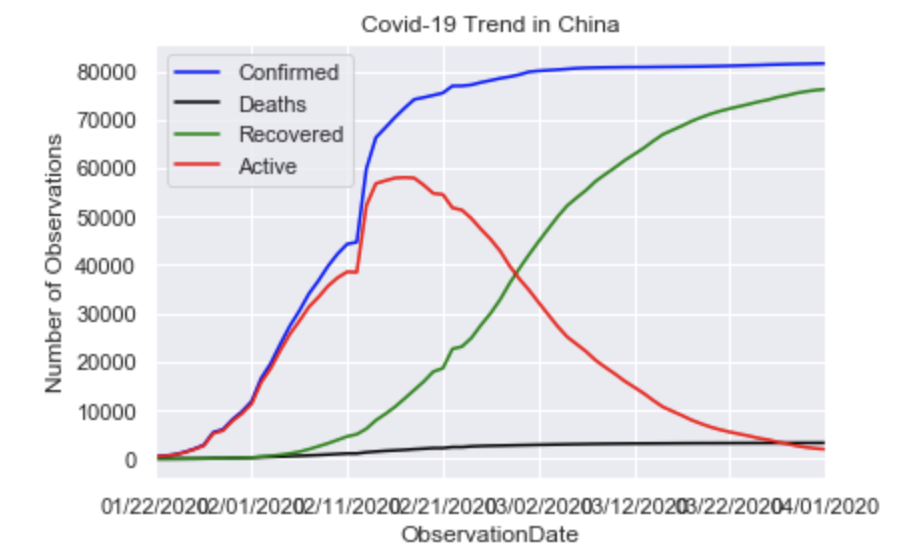

#### Coronavirus-Analysis
#####  Objective:
1. COVID-19 has have profound disruptive effects on the global ecconmy.Thousands of people have been infected. Schools are closed. Most activites are prohibited.Travels are baned,and people are panic..,etc
2. This study uses datasets from Kaggal, attempts to get the answers from questions that have arisen from the outbreak of the Covid-19:
    * What are current status of impacted countries: confirmed cases, death rate, and recovery rate?
    * Symptoms of Covid-19
    * Men or women, who are more susceptible to the virus?
    * What is the vulnerable age?
    * What can we learn from China - ground zero?
    * What are the future for USA, Italy, Spain, and India?

* Feature Engineering:
    
    * New feature is created using formula: 'Active cases' = 'Confirmed' - 'Recovery' - 'Death'.
    

* Data Visualization:
    
    * Word Countries Map
        * Using Matplotlib to generate a World Countries Map with Covid-19.
        
    
    * Plot a "Gender Distribution" bar chart using Matplotlib.pyplot.
       
        
         * Male are more succeptible to the virus than female.
    
    * Plot an "Age Distribution" histogram using Matplotlib.pyplot.
        
        
        
        * The average age of patient with the virus is 49 years old
        * The youngest patient is zero - 0 years old
        * The oldest patient is 96 years old
    
    * Generate WordClouds using Natural Language Processing to extract texts from the 'Symptom' feature.
    
        
        
        * Patients with Covid-19 have these symptoms:
            * Cough
            * Fever
            * Discomfort breath
            * Vomiting
            * Diarrhea
            * Fatigue
            * Chills
            * Muscle pain,..etc
            

* Countries Trending Analysis:
    
    1. World Trends: 
        
        
        
        - Key Takeaways:
           
        

    2. China:
        - Using Index slicing to subset Region where the Country = 'Mainland China'
        - Use probability statistics and the 'group by' method to calculate the       number of confirmation cases, death rate, recovered rate, and active cases.
        - Create trending status using Matplotlib.pyplot
        
        
        
           
        
        
    3. South Korea:
       
       - The same methods are applied as in China to generate trending status for the pandemic in South Korea
        
        
        
            
        

    4. Italy:
        
        
        
        - Key Takeaways:
            
            
    
    5. USA:
        
        
        
        - Key Takeaways:
         
            
        
    6. Spain:
        
        
        
        - Key Takeaways:
           
            
        
* World Trends Confirmed Cases by Day

    

    - Key Takeaways:
     
        * At the begining of February the confirmed cases in China, S.Korea, Italy, USA, & Spain are 11,871;12; 0; 6; and 1 respectively
        * Confirmed cases In China rise steadily and in mid Feb, it seems Chinal has control over the pandemic. The confirmed cases of China are level off from mid Feb. At 04/01/20 confirmed cases are 81,555 cases
        * Meanwhile at Mar 15th confirmed cases in USA start to increase suddenly, and at the beginning of April its confirmed cases are 213,372 cases
        * South Korea has handled the pandemic very well. At 04/01/20 confirmed cases in South Korea are 9,887 cases
        * Confirmed cases in both Italy and Spain are increasing, at 04/01/20 the confirmed cases in both countries are 110,574 and 104,118 respectively 
        * We should take notes and learn how China and South Korea handle the pandemic !
      

      
    

    
    
    
  