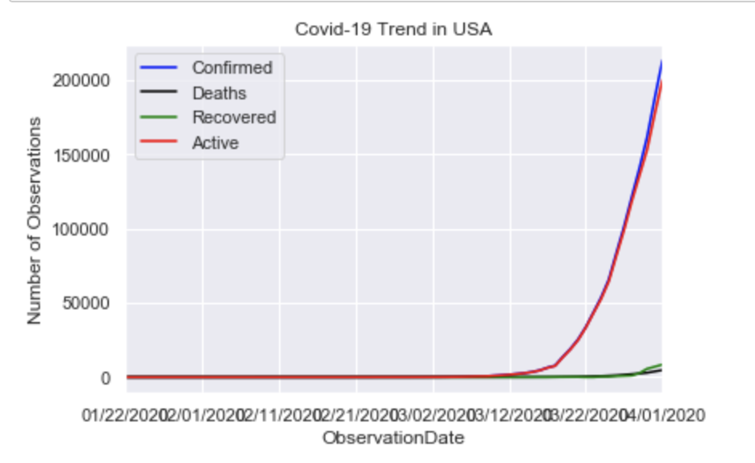

#### Coronavirus-Analysis
#####  Objective:
1. COVID-19 has have profound disruptive effects on the global ecconmy.Thousands of people have been infected. Schools are closed. Most activites are prohibited.Travels are baned,and people are panic..,etc
2. This study uses datasets from Kaggal, attempts to get the answers from questions that have arisen from the outbreak of the Covid-19:
    * What are current status of impacted countries: confirmed cases, death rate, and recovery rate?
    * Symptoms of Covid-19
    * Men or women, who are more susceptible to the virus?
    * What is the vulnerable age?
    * What can we learn from China - ground zero?
    * What are the future for USA, Italy, Spain, and India?

* Feature Engineering:
    * New feature is created using formula: 'Active cases' = 'Confirmed' - 'Recovery' - 'Death'.
    

* Data Visualization:
    
    * Word Countries Map
        * Using Matplotlib to generate a World Countries Map with Covid-19.
        
    
    * Plot a "Gender Distribution" bar chart using Matplotlib.pyplot.
        * Male are more succeptible to the virus than female.
        
    
    * Plot an "Age Distribution" histogram using Matplotlib.pyplot.
        * The average age of patient with the virus is 49 years old
        * The youngest patient is zero - 0 years old
        * The oldest patient is 96 years old
        
    
    * Generate WordClouds using Natural Language Processing to extract texts from the 'Symptom' feature.
        * Cough
        * Fever
        * Discomfort breath
        * Vomiting
        * Diarrhea
        * Fatigue
        * Chills
        * Muscle pain,..etc
        
    
    * Create barh chart to rank countries from the most confirmed cases to the least.
        

* Countries Trending Analysis:
    
    1. World Trends: 
        
        
        - Key Takeaways:
            * There are 156 countries that are affected by Covid-19
            * The start date and end date for this dataset are from 1/22/20 - 3/14/20 respectively (7 weeks)
            * Confirmed cases start very low at the beginning of Feb,and increase sharply thereafter. It levels off on the beginning of March
            * Active cases follow a bell shape with its peak on mid Feb suggesting an increasing in recovered cases from that date
            * Very few cases are recovered at the start, but the recovered rate increase steadily. Whatever solutions here work!
            * Death rate is increasing
            * Will analyze countries with the highest confirmation cases on the list
    
    2. China:
        - Using Index slicing to subset Region where the Country = 'Mainland China'
        - Use probability statistics and the 'group by' method to calculate the       number of confirmation cases, death rate, recovered rate, and active cases.
        - Create trending status using Matplotlib.pyplot
        
        
        
        - Key Takeaways:
            * Number of confirmed cases continues to grow sharply from 01/22/20 to the end for Feburary.It then starts level off the first week of March
            * Number of Deaths are steadily increasing from 1/22/20 - 3/14/20. It continues increading even when the confirmed cases are stablized. It can be inferred that the previous confirmed cases were not be able to recovered.
            * The recovery rate in the first 10 days is zero.But after that it increase sharply, and continue to grow. China did very well in fighting the virus
            * Active cases went down sharply from 2/21 - 3/05/20.This is very easy to explain. Since the confirmed cases are stable, the recovery rate is increase sharply; therefore active cases drop dramatically.
            * China did very good job in handling the pandemic. Since the first week of March, confirmed cases are stablized, recovered rate are shot up, active cases drop sharply. The other countries should learn the ways China handles the crisis.
            * In China, since 03/05/20, Active Cases and Recovery Percentage is 22.82%, 73.32% respectively and Death Rate is 3.86%.
    
    3. South Korea:
       
       - The same methods are applied as in China to generate trending status for the pandemic in South Korea
        
        
        - Key Takeaways:
            * There is a sudden surge in confirmed and active cases starts on 2/21/20 in South Korea
            * The confirmed and active cases are almost identical
            * However, death and recovered rate are flat - zero
            * Death rate is 0.7 % compares to 3.86% of China
            * South Korea has been well prepared for the pandemic!
            * Active Cases and Recovery Percentage is 96.58%, 2.72% respectively and Death Rate is 0.7%.
    
    4. Italy:
        
        
        
        - Key Takeaways:
            * In Italy,there isn't any report cases from 1/31/20 to 2/15/20
            * There is a sudden surge for all status: confirmed,active deatth and recovery cases
            * Death rate and recovery rate are almost identical: 6.11% & 8.67% respectively. An alarming rate!
            * Trending is different than China
            * Active Cases and Recovery Percentage is 85.22%, 8.67% respectively and Death Rate is 6.11% !!
    
    5. USA:
        
        
        
        - Key Takeaways:
            * There aren't any report about the outbreak until 2/21/20
            * There is a huge surge in confirmed cases and active cases starting at the beginning of March
            * Confirmed and active cases are almost identical
            * There is a subtle increase in death rate compare to recovered rate on 3/12/20
            * Actice cases are huge, recovered less than deaths. USA must do something to control the situation
            *  Active Cases and Recovery Percentage is 95.62%, 1.74% respectively and Death Rate is 2.63%.
    
    6. Spain:
        
        
        
        - Key Takeaways:
            * There is a straight up surge in confirmed and active cases in Spain beginging on 3/12/20
            * Confirmed cases and active cases are almost the same, meaning much less recovered cases
            * Deaths rate and recovered rate both increase at the beginning of the second week in March
            * Active Cases and Recovery Percentage is 91.73%, 5.77% respectively and Death Rate is 2.5%
 
 
    
      

      
    

    
    
    
  